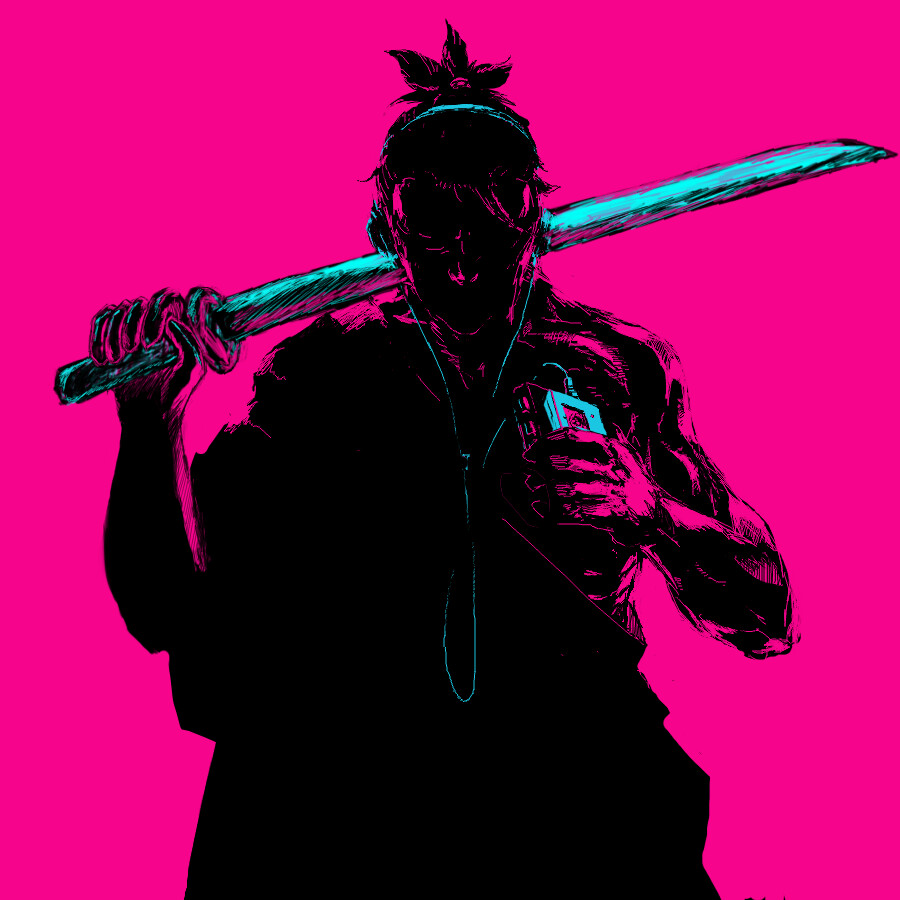

<h1 align="center">HERE IS UNRAOUS</h1>

  
  
  
  
  
  
  
  
  
  
   
  
  
  
  
   
  
  
  
  
   
  
  
  

###  ABOUT 
- 🚀 Continuously learning to become a full-stack developer.
- 🎓 Major in Computer Science at BUPT.
- ⏰ Online [8:00-23:00][UTC+8](https://time.is/UTC+8)

### STATS

